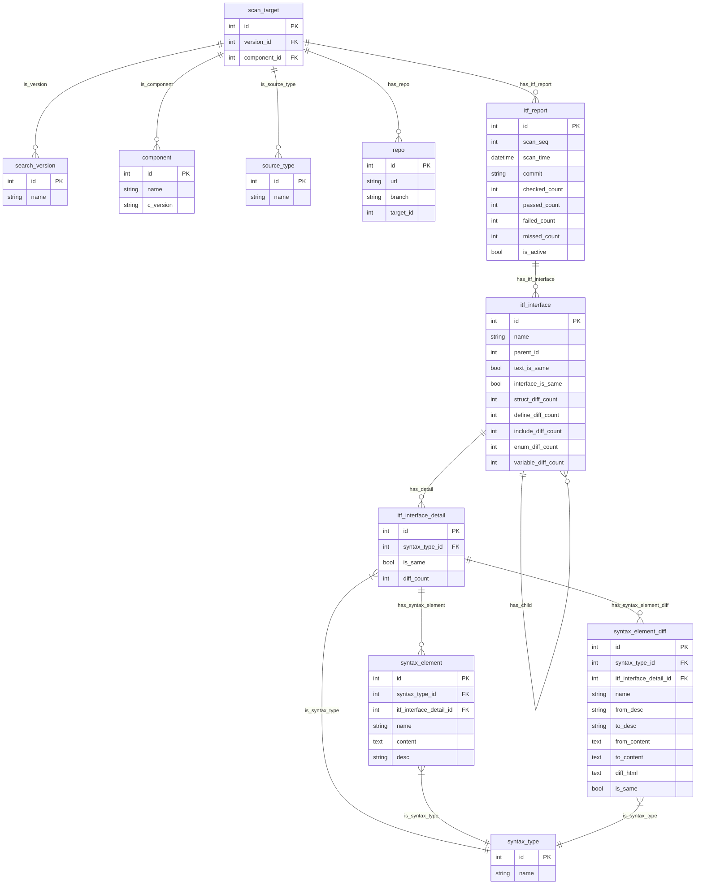

```mermaid
erDiagram
    search_version {
      int id PK
      string name
    }

    component {
      int id PK
      string name
      string c_version
    }

    source_type {
      int id PK
      string name
    }

    scan_target {
      int id PK
      int version_id FK
      int component_id FK
    }

    repo {
      int id PK
      string url
      string branch
      int target_id
    }

    itf_report {
      int id PK
      int scan_seq
      datetime scan_time
      string commit
      int checked_count
      int passed_count
      int failed_count
      int missed_count
      bool is_active
    }

    itf_interface {
      int id PK
      string name
      int parent_id
      bool text_is_same
      bool interface_is_same
      int struct_diff_count
      int define_diff_count
      int include_diff_count
      int enum_diff_count
      int variable_diff_count
    }

    syntax_type {
      int id PK
      string name
    }

    itf_interface_detail {
      int id PK
      int syntax_type_id FK
      bool is_same
      int diff_count
    }

    syntax_element {
      int id PK
      int syntax_type_id FK
      int itf_interface_detail_id FK
      string name
      text content
      string desc
    }

    syntax_element_diff {
      int id PK
      int syntax_type_id FK
      int itf_interface_detail_id FK
      string name
      string from_desc
      string to_desc
      text from_content
      text to_content
      text diff_html
      bool is_same
    }

    scan_target ||--o{ search_version : is_version
    scan_target ||--o{ component : is_component
    scan_target ||--o{ source_type : is_source_type
    scan_target ||--o{ repo : has_repo
    scan_target ||--o{ itf_report : has_itf_report
    itf_report ||--o{ itf_interface : has_itf_interface
    itf_interface ||--o{ itf_interface : has_child
    itf_interface ||--o{ itf_interface_detail : has_detail
    itf_interface_detail }|--|| syntax_type : is_syntax_type
    itf_interface_detail ||--o{ syntax_element : has_syntax_element
    itf_interface_detail ||--o{ syntax_element_diff : has_syntax_element_diff
    syntax_element }|--|| syntax_type : is_syntax_type
    syntax_element_diff }|--|| syntax_type : is_syntax_type

```