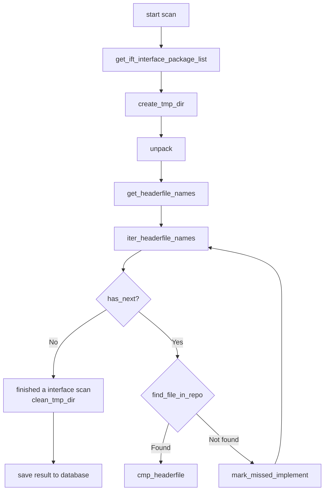

## 扫描流程图

```mermaid
graph TD
    A0[start scan]-->A1[get_ift_interface_package_list]
    A1-->A2[create_tmp_dir]
    A2-->A3[unpack]
    A3-->A4[get_headerfile_names]
    A4-->A5[iter_headerfile_names]
    A5-->A51{has_next?}
    A51-->|No|E1[finished a interface scan <br /> clean_tmp_dir]
    A51-->|Yes|A6{find_file_in_repo}
    A6-->|Found|A7[cmp_headerfile]
    A6-->|Not found|A8[mark_missed_implement]
    A8-->A5

    E1-->D1[save result to database]
```
